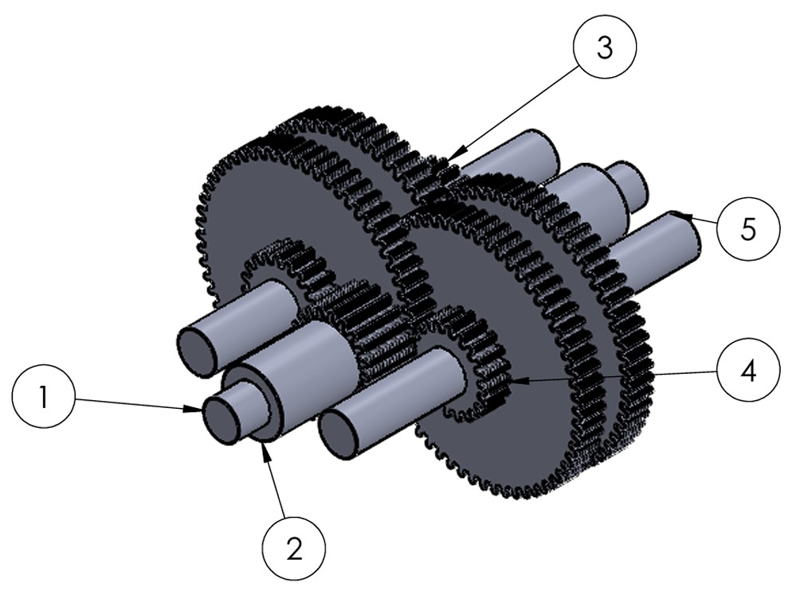
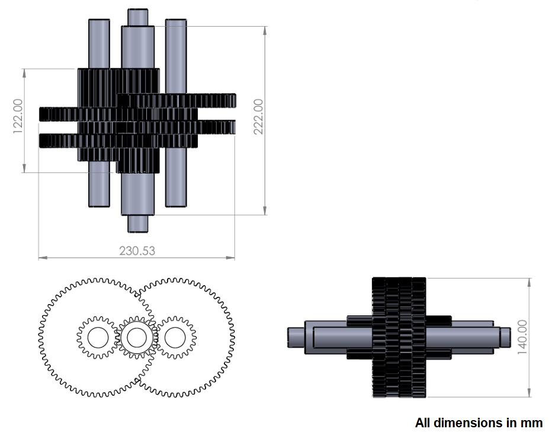
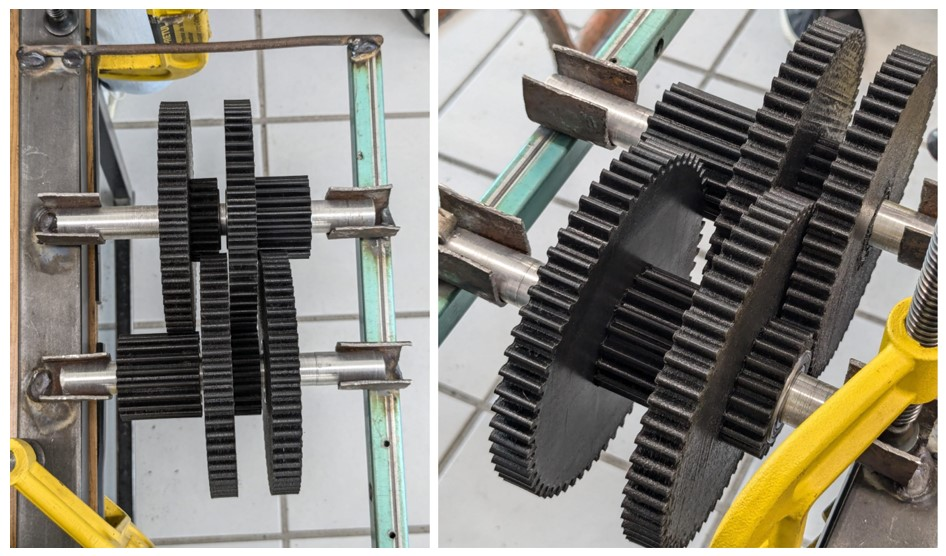

# High-Ratio Speed Multiplier Gearbox for Offshore Wind Turbine
**Mechanical Design, CAD Modeling, and Additive Manufacturing Validation**

## Project Overview
Design and prototyping of a 4-stage parallel axis gearbox for a scale-model offshore wind turbine. The system achieves a **1:81 gear ratio**, transforming an input of 10 RPM (turbine blades) to 810 RPM (generator input).

## Tech Stack
* **CAD Software:** SolidWorks (CSWA Certified skills).
* **Engineering Principles:** Gear ratio calculations, interference analysis, and DFM (Design for Manufacturing).
* **Manufacturing:** 3D Printing (PLA) with tolerance adjustment.

---

## Project Case Study

### **Situation**
As part of the **Delfín Research Program**, I was tasked with developing a speed multiplier for an experimental offshore wind turbine. The challenge was to achieve a high transmission ratio (near 1:100) within a compact space, ensuring the output speed was sufficient to reach the generator's nominal voltage.

### **Task**
My objective was to design a functional 4-stage gearbox, calculate the exact gear teeth counts for each stage, model the assembly in SolidWorks, and produce a physical prototype using 3D printing to validate mechanical clearances and smooth operation.

### **Action**
1. **Kinematic Calculation:** Defined a 4-stage architecture with a partial ratio of 1:3 per stage ($3^4 = 81$), resulting in an input/output ratio of 1:81.
2. **CAD Modeling:** Designed the gears (pinions and crowns), shafts, and housing in **SolidWorks**, ensuring proper center distances to avoid gear binding.
3. **Tolerance Engineering:** Based on initial 3D printing tests, I identified a 0.3mm interference issue. I redesigned the bearing housings from 37.1mm to **37.4mm** to account for material shrinkage and ensure a press-fit assembly.
4. **Prototyping:** Validated the assembly using PLA 3D printing, testing the torque transmission and axial alignment of the shafts.

### **Results**
* **Target Achievement:** Successfully transformed 10 RPM into 810 RPM, meeting the generator's operational requirements.
* **DFM Optimization:** Reduced assembly time by implementing a modular housing design that allows for easy bearing replacement.
* **Precision:** Achieved a functional prototype with zero mechanical interference after the second design iteration.

---

## Engineering Documentation

### 1. 3D Assembly

| Item No. | Part Name / Description | Quantity |
| :--- | :--- | :---: |
| 1 | Input and output shafts | 2 |
| 2 | Pinion with hooks | 2 |
| 3 | Pinion | 1 |
| 4 | Pinion and ring gear | 4 |
| 5 | Parallel shaft | 2 |

### 2. From Digital Design to Physical Prototype
| Gearbox measurements | 3D Printed Prototype |
| :--- | :--- |
|  |  |

## Repository Structure
* `/cad-models`: Solidworks files
* `/drawings`: Technical blueprints.
* `/calculations`: Spreadsheets and maths.
* `/docs`: Full research report (Proyecto Delfín).
* `/media`: Visual evidence and system demonstrations.

---
**Contact Information**
* **Diego Armando Soriano Sánchez** - [LinkedIn](https://www.linkedin.com/in/diego-soriano-30381b220/)
* **Email:** diegoarmando.sori@gmail.com
